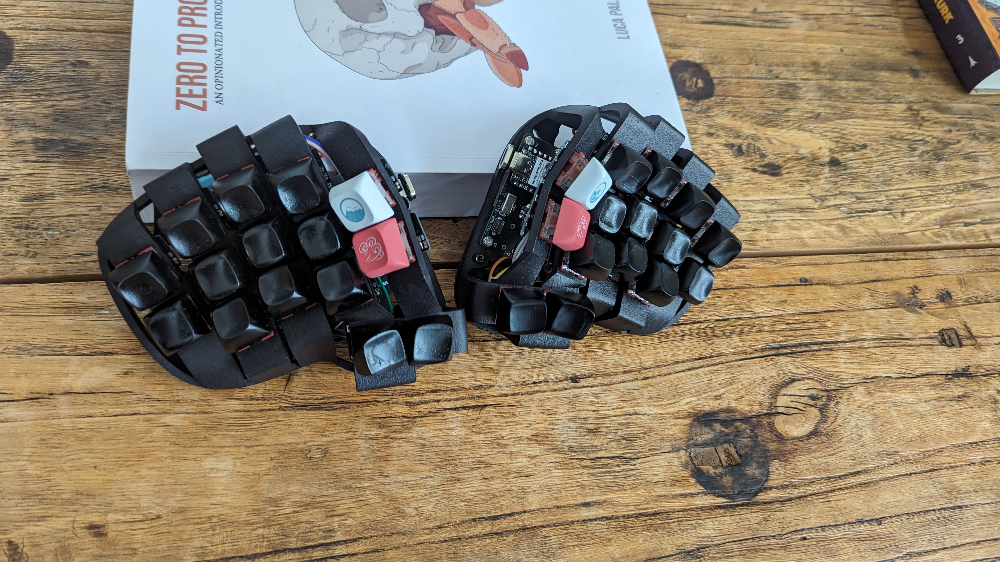

# Rommana

### A 30 keys split keyboard powered by Xiao BLE.

Credits to [AlaaSaadAbdo](https://github.com/AlaaSaadAbdo) for this amazing design.

For the source files, go to [this page](https://github.com/AlaaSaadAbdo/Rommana).

This build log is a afterthought, so I don't have many pictures of the process. I'll try to explain as best as I can.

#### Parts

- 2x Seeeduino Xiao BLE
- 2x MCU holder (Ordered from JLCPCB with files from the source)
- 10x Column flex PCB (Ordered from JLCPCB with 0.8mm thickness)
- 30x Mx switches
- 30x Kailh hotswap sockets
- 30x SMD diodes
- 2x Mill Max sockets
- 2x Top push reset buttons
- 2x SK12D07VG3 Mini Slide Switch
- 4x Pogo pins
- 2x AAA battery holder
- 2x Battery ICR-10440 3.7V 350mAh

#### Build

Step 1: Solder the diodes and the hotswap sockets to the flex PCBs.

Step 2: Cut off the third switch pcb from 4 of the flex pcbs. This is the thumb cluster and the collumns with 2 switches.

Step 3: Solder all the jumper pads on the MCU holders except the bottom left one in the picture below. This is the 5v jumper.

Step 4: Solder the reset buttons, slide switches, and the mill max sockets to the MCU holders.

Step 5: Solder the pins to the controller.

Step 6: Remove the controller from the PCB and solder the pogo pins to the MCU holder. Make sure to solder the pins to the correct position, they are for BAT+ and RST pads. See XIAO pinout for reference.

Step 7: _This step is not needed in the current version of the MCU holder._
In my version of the MCU holder the bat+ was bypassing the slide switch. I had to cut the trace and solder a bodge wire to the switch. Use a exacto knife with a sharp blade to cut the trace on the purble line. Put the blade point on the trace and use a drilling motion to cut it. Use a multimeter to check if the trace is cut. Then solder a wire from the switch to the bat+ pad.

