# Rommana

### A 30 keys split keyboard powered by Xiao BLE.

Credits to [AlaaSaadAbdo](https://github.com/AlaaSaadAbdo) for this amazing design.

For the source files, go to [this page](https://github.com/AlaaSaadAbdo/Rommana).

This build log is a afterthought, so I don't have many pictures of the process. I'll try to explain as best as I can.

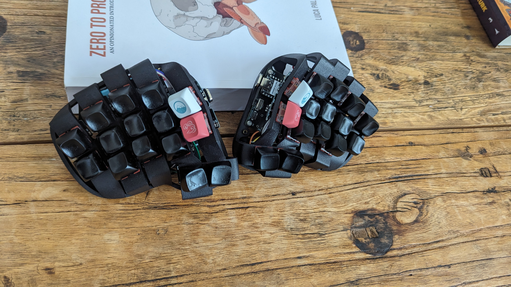

#### Parts

- 2x Seeeduino Xiao BLE
- 2x MCU holder (Ordered from JLCPCB with files from the source)
- 10x Column flex PCB (Ordered from JLCPCB with 0.8mm thickness)
- 30x Mx switches
- 30x Kailh hotswap sockets
- 30x SMD diodes
- 2x Mill Max sockets
- 2x Top push reset buttons
- 2x SK12D07VG3 Mini Slide Switch
- 4x Pogo pins
- 2x AAA battery holder
- 2x Battery ICR-10440 3.7V 350mAh

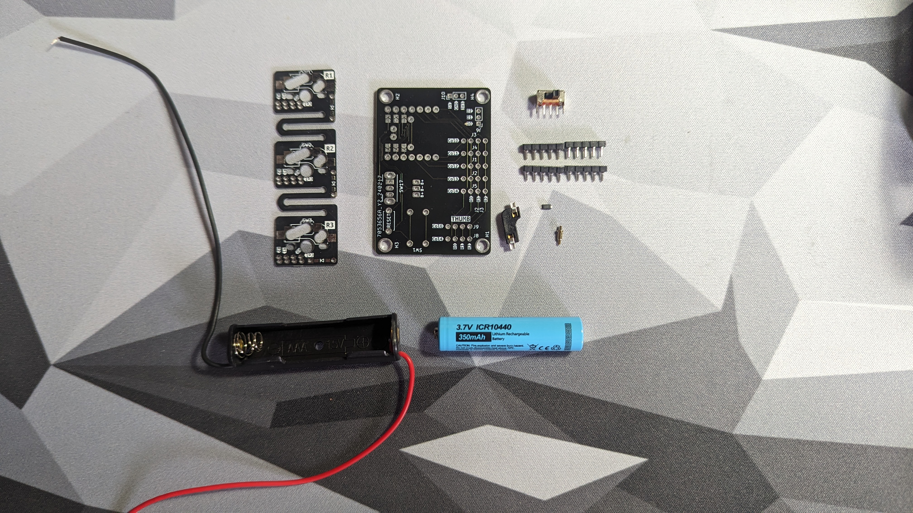

#### Build

Step 1: Solder the diodes and the hotswap sockets to the flex PCBs.

Step 2: Cut off the third switch pcb from 4 of the flex pcbs. This is for the thumb cluster and the columns with 2 switches.

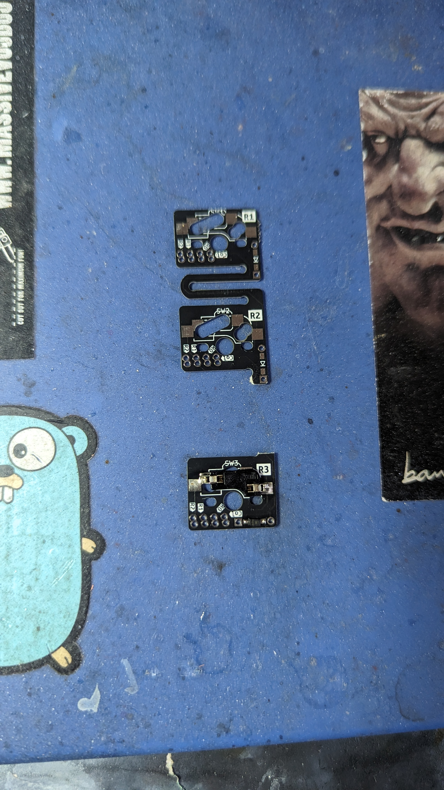

Step 3: Solder all the jumper pads on the MCU holders except the bottom left one in the picture below(red arrow). This is the 5v jumper.

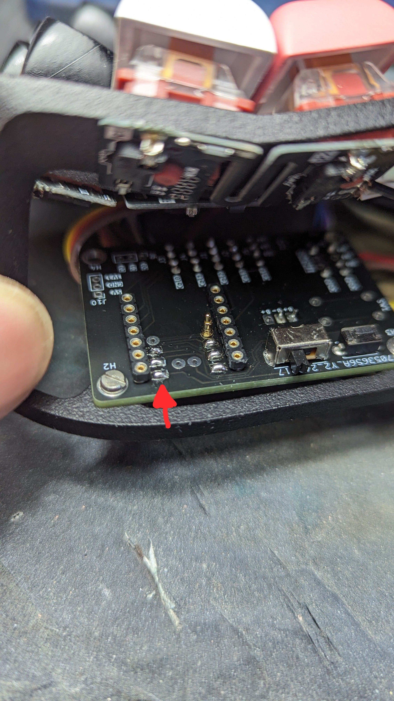

Step 4: Solder the reset buttons, slide switches, and the mill max sockets to the MCU holders.

Step 5: Solder the pins to the controller.

Step 6: Remove the controller from the PCB and solder the pogo pins to the MCU holder. Make sure to solder the pins to the correct position, they are for BAT+ and RST pads. See XIAO pinout for reference.

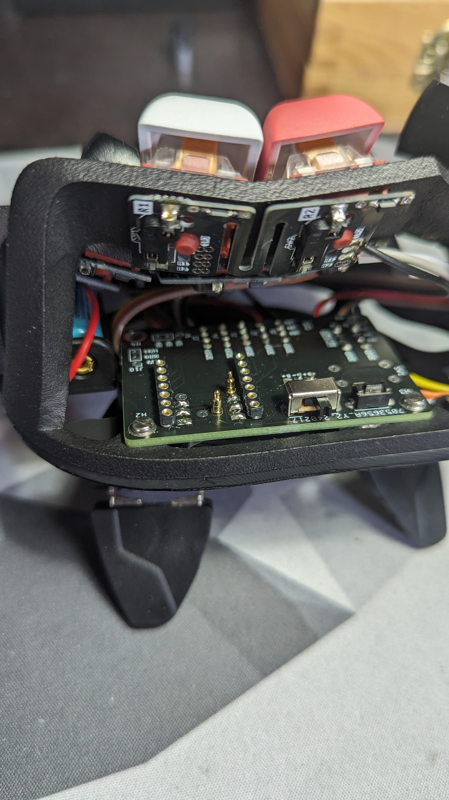

Step 7: _This step is not needed in the current version of the MCU holder._
In my version of t...he MCU holder the bat+ was bypassing the slide switch. I had to cut the trace and solder a bodge wire to the switch. Use a exacto knife with a sharp blade to cut the trace on the purble line. Put the blade point on the trace and use a drilling motion to cut it. Use a multimeter to check if the trace is cut. Then solder a wire from the switch to the bat+ pad.

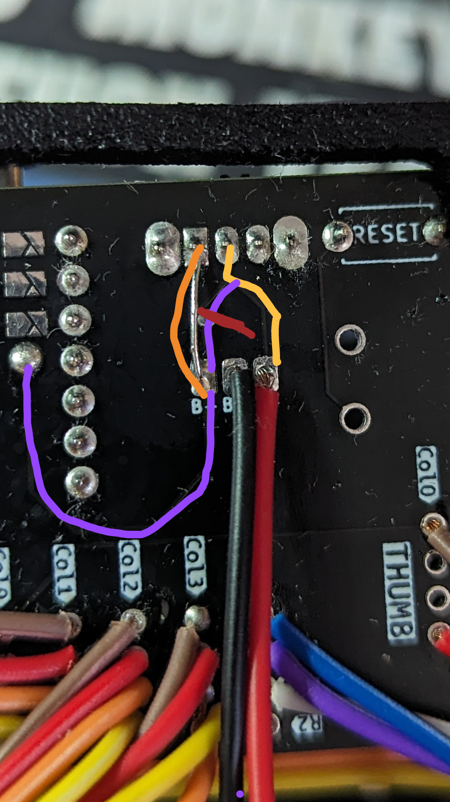
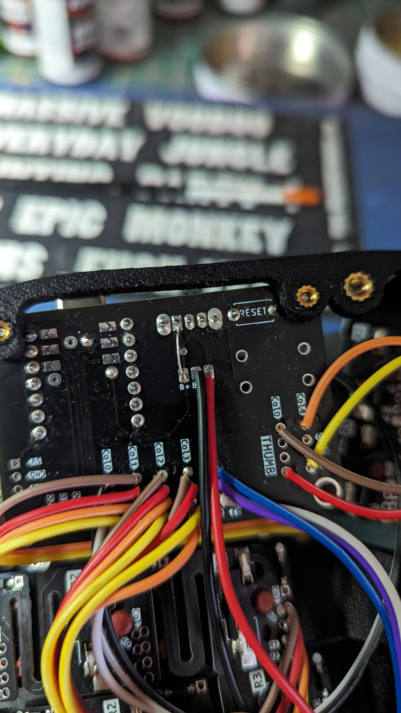

Step 8: Solder wires to the flex pcbs. You need to solder 4 wires to the bottom switch for the columns with 3 switches. For the columns with 2 switches you need to solder 3 wires, starting from Col to R1 on the bottom switch. For the thumbs only 2 wires are needed, Col and R2.

Step 9: Solder the wires to the MCU holder. In my build i solderd them from the bottom. I would recommend soldering them from the top since this will give the wires more room to bend in the case. Col 0 on the MCU holder goes the the switch row with 2 switches for the index finger. Col 1 goes to the switch row with 3 switches for the index finger. Col 2 goes to the switch row with 3 switches for the middle finger. Col 3 goes to the switch row with 3 switches for the ring finger. Col 4 goes to the switch row with 2 switches for the pinky finger. On the rows with 2 switches you only need solder Col to R1. As for the thumb cluster look for the markings on the pcb fow thumbs and solder Col and R2. Col 4 is the inner thumb switch and Col 0 is the outer thumb switch.

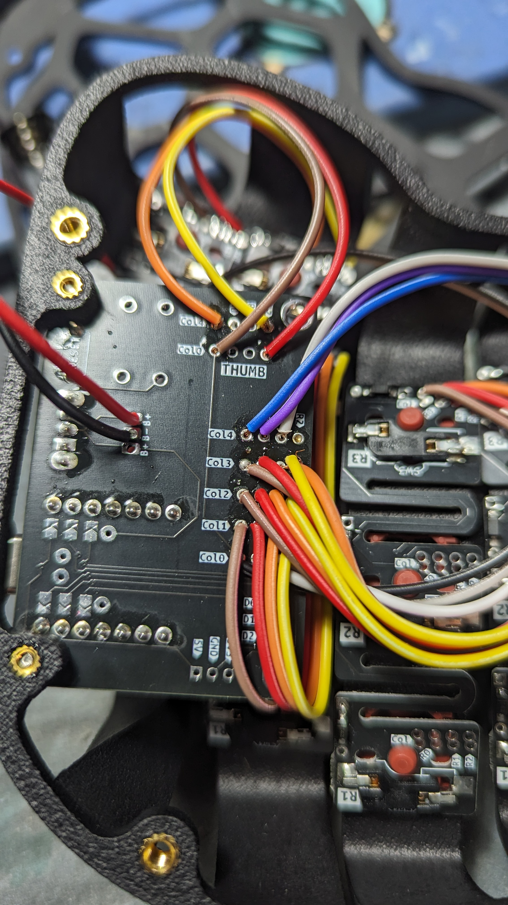
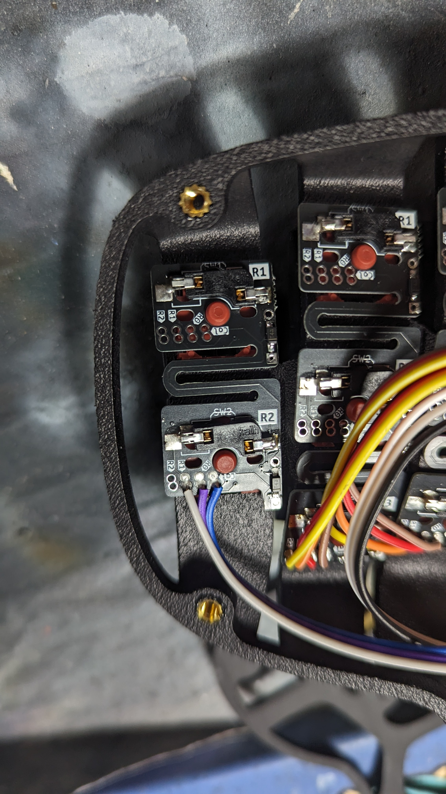

Step 10: Flash the firmware and test each switch with a mx switch. If everything is working as expected you can move on to the next step.

Step 11: Solder the battery holder to the MCU holder. The red wire goes to the BAT+ pad and the black wire goes to the BAT- pad.
.
Step 12: Assemble the keyboard. Put the mx switches in the case and add the flex pcbs one by one. Skrew the MCU holders to the case. For the battery holder i glued them to the bottom case in a spot where they don't interfere with the switches. Im sure there are better ways to do this but this is what i came up with.
Skrew the top case to the bottom case and you are done.

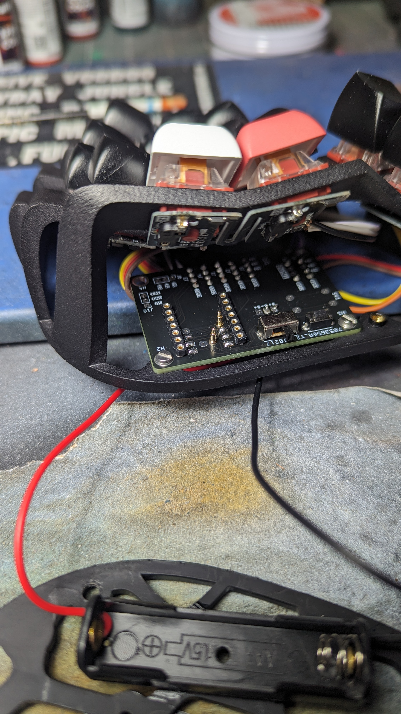

Step 13: (Optional) I like some tenting on my keyboards and this is my solution. I bought a magsafe tripod mount and glued it to the bottom case. I then bought a magsafe phone holder and glued it to the bottom plate. Im then using Manfrotto pocket tripods to tent the keyboard. This is a very simple solution and it works great.

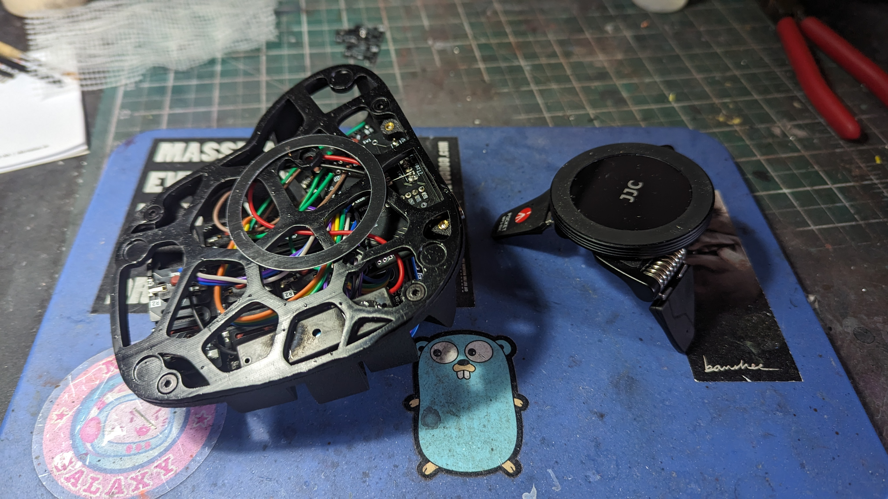
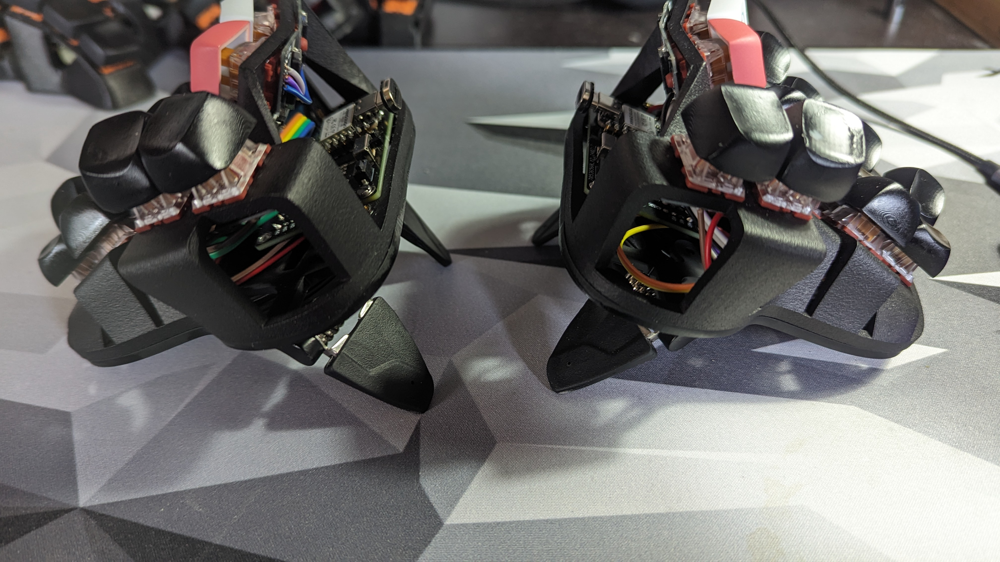
